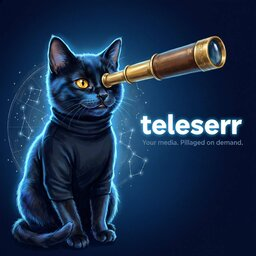
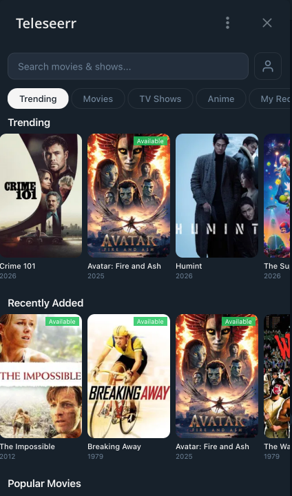
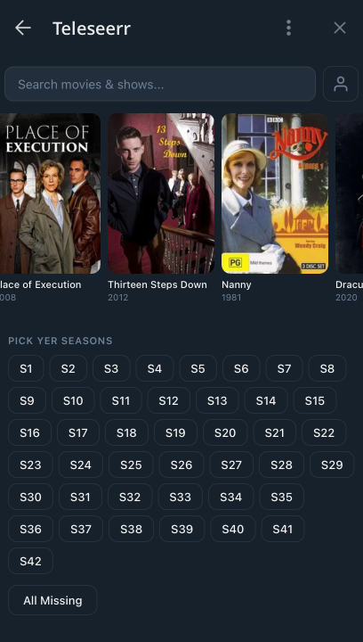

# Teleseerr



A Telegram bot and [Mini App](https://core.telegram.org/bots/webapps) for requesting movies, TV shows, and anime through [Seerr](https://github.com/seerr-team/seerr) (Overseerr/Jellyseerr).

Browse trending media, search, and make requests — all without leaving Telegram.

<br clear="left">

## Features

- **Mini App** — Full media browser with trending, genre discovery, search, detailed views, and season picker
- **Request media** — Movies, TV shows (season-level), and anime with 4K support
- **Per-user quotas** — Each user is linked to a Seerr account so quotas and auto-approve rules apply
- **Notifications** — Get a Telegram DM when your request is approved, available, or declined (via Seerr webhooks)
- **Admin panel** — Link/unlink users, approve pending access requests, ignore spam
- **Browser access** — Works outside Telegram via the Login Widget

<p align="center">
  
  
</p>

## Setup

### Prerequisites

- [Seerr](https://github.com/seerr-team/seerr) instance with an API key
- Telegram bot token from [@BotFather](https://t.me/BotFather)
- Your Telegram user ID (get it from [@userinfobot](https://t.me/userinfobot))

### Environment variables

Copy `.env.example` and fill in the values:

```bash
cp .env.example .env
```

| Variable | Required | Default | Description |
|----------|----------|---------|-------------|
| `TELEGRAM_BOT_TOKEN` | Yes | — | Bot token from BotFather |
| `SEERR_URL` | Yes | — | Seerr base URL (e.g. `http://seerr:5055`) |
| `SEERR_API_KEY` | Yes | — | Seerr admin API key |
| `TELESEERR_ADMIN_USER_ID` | Yes | — | Your Telegram user ID (message [@userinfobot](https://t.me/userinfobot) to get it) |
| `TELESEERR_ADMIN_SEERR_USER_ID` | No | `1` | Seerr user ID to auto-link admin on startup |
| `TELESEERR_MINI_APP_URL` | No | — | Public HTTPS URL where the Mini App is served |
| `TELESEERR_MINI_APP_PORT` | No | `3000` | HTTP server port |
| `TELESEERR_WEBHOOK_SECRET` | No | — | Secret for Seerr webhook URL (`openssl rand -hex 32`) |
| `TELESEERR_DEFAULT_4K` | No | `false` | Default 4K preference |
| `TELESEERR_ANIME_SONARR_ID` | No | — | Seerr service ID for a dedicated anime Sonarr |
| `TELESEERR_DATA_DIR` | No | `./data` | Data directory for JSON stores |

### Docker Compose (recommended)

```yaml
services:
  teleseerr:
    image: ghcr.io/nikamura/teleseerr:latest
    container_name: teleseerr
    environment:
      - TELEGRAM_BOT_TOKEN=${TELESEERR_TELEGRAM_BOT_TOKEN}
      - SEERR_URL=http://seerr:5055
      - SEERR_API_KEY=${TELESEERR_SEERR_API_KEY}
      - TELESEERR_ADMIN_USER_ID=${TELESEERR_ADMIN_USER_ID}
      - TELESEERR_MINI_APP_URL=https://teleseerr.example.com
      - TELESEERR_WEBHOOK_SECRET=${TELESEERR_WEBHOOK_SECRET}
    volumes:
      - ./teleseerr-data:/app/data
    networks:
      - default
      - arr_default
    restart: unless-stopped
```

The container needs network access to your Seerr instance.

> [!IMPORTANT]
> The Mini App is embedded inside Telegram as a WebView — Telegram's servers load it on behalf of the user. This means `TELESEERR_MINI_APP_URL` must be a **publicly accessible HTTPS URL**, not a local/private IP. You'll need a reverse proxy (Caddy, nginx, Traefik) with a valid TLS certificate, or a tunnel like [ngrok](https://ngrok.com/) or [Cloudflare Tunnel](https://developers.cloudflare.com/cloudflare-one/connections/connect-networks/).

> [!NOTE]
> **Anime Sonarr** — If you have a dedicated anime Sonarr instance in Seerr, set `TELESEERR_ANIME_SONARR_ID` to its Seerr service ID. Anime requests will be automatically routed there based on TMDB keywords. Without this, all TV requests (including anime) go to the default Sonarr.

### Development

```bash
pnpm install
pnpm dev    # live reload with tsx watch
```

### Seerr webhook

To receive notifications when requests are approved/available, configure a webhook in Seerr:

**Settings → Notifications → Webhook:**
- URL: `https://your-domain/webhook/<your-secret>`
- See `SPEC.md` for the JSON payload template

## How it works

Users message the bot or tap the menu button to open the Mini App. New users are blocked until an admin links their Telegram account to a Seerr user. The admin gets a Telegram notification when someone new wants access and can link them from the admin panel in the Mini App.

All Seerr API calls use the admin API key, but requests are attributed to the linked Seerr user so per-user quotas and auto-approve rules are respected.

## Tech stack

- **Bot**: [grammY](https://grammy.dev/) (TypeScript)
- **Frontend**: Vanilla JS with [Telegram Web App SDK](https://core.telegram.org/bots/webapps)
- **Runtime**: Node.js 22
- **Data**: JSON files (no database)
