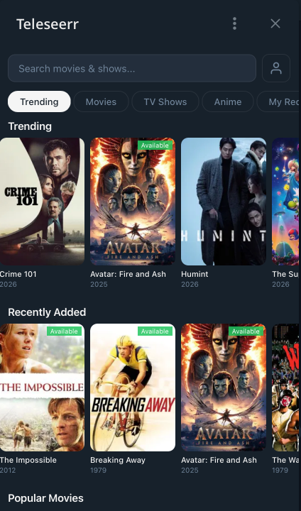
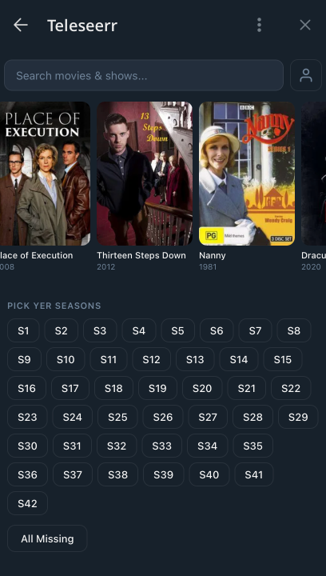

# Teleseerr


A Telegram bot and [Mini App](https://core.telegram.org/bots/webapps) for requesting movies, TV shows, and anime through [Seerr](https://github.com/seerr-team/seerr) (Overseerr/Jellyseerr).

Browse trending media, search, and make requests — all without leaving Telegram.

<br clear="left">

## Features

- **Mini App** — Full media browser with trending, genre discovery, search, detailed views, and season picker
- **Request media** — Movies, TV shows (season-level), and anime with 4K support
- **Per-user quotas** — Each user is linked to a Seerr account so quotas and auto-approve rules apply
- **Notifications** — Get a Telegram DM when your request is approved, available, or declined (via Seerr webhooks)
- **Admin panel** — Link/unlink users, approve pending access requests, ignore spam
- **Browser access** — Works outside Telegram via the Login Widget

<p align="center">
  
  
</p>

## Setup

### Prerequisites

- [Seerr](https://github.com/seerr-team/seerr) instance with an API key
- Telegram bot token from [@BotFather](https://t.me/BotFather)
- Your Telegram user ID (get it from [@userinfobot](https://t.me/userinfobot))

### Environment variables

Copy `.env.example` and fill in the values:

```bash
cp .env.example .env
```

| Variable | Required | Default | Description |
|----------|----------|---------|-------------|
| `TELEGRAM_BOT_TOKEN` | Yes | — | Bot token from BotFather |
| `SEERR_URL` | Yes | — | Seerr base URL (e.g. `http://seerr:5055`) |
| `SEERR_API_KEY` | Yes | — | Seerr admin API key |
| `TELESEERR_ADMIN_USER_ID` | Yes | — | Your Telegram user ID (message [@userinfobot](https://t.me/userinfobot) to get it) |
| `TELESEERR_ADMIN_SEERR_USER_ID` | No | `1` | Seerr user ID to auto-link admin on startup |
| `TELESEERR_MINI_APP_URL` | No | — | Public HTTPS URL where the Mini App is served |
| `TELESEERR_MINI_APP_PORT` | No | `3000` | HTTP server port |
| `TELESEERR_WEBHOOK_SECRET` | No | — | Secret for Seerr webhook URL (`openssl rand -hex 32`) |
| `TELESEERR_DEFAULT_4K` | No | `false` | Default 4K preference |
| `TELESEERR_ANIME_SONARR_ID` | No | — | Seerr service ID for a dedicated anime Sonarr |
| `TELESEERR_DATA_DIR` | No | `./data` | Data directory for JSON stores |

### Docker Compose (recommended)

```yaml
services:
  teleseerr:
    image: ghcr.io/nikamura/teleseerr:latest
    container_name: teleseerr
    environment:
      - TELEGRAM_BOT_TOKEN=${TELESEERR_TELEGRAM_BOT_TOKEN}
      - SEERR_URL=http://seerr:5055
      - SEERR_API_KEY=${TELESEERR_SEERR_API_KEY}
      - TELESEERR_ADMIN_USER_ID=${TELESEERR_ADMIN_USER_ID}
      - TELESEERR_MINI_APP_URL=https://teleseerr.example.com
      - TELESEERR_WEBHOOK_SECRET=${TELESEERR_WEBHOOK_SECRET}
    volumes:
      - ./teleseerr-data:/app/data
    networks:
      - default
      - arr_default
    restart: unless-stopped
```

The container needs network access to your Seerr instance.

> [!IMPORTANT]
> The Mini App is embedded inside Telegram as a WebView — Telegram's servers load it on behalf of the user. This means `TELESEERR_MINI_APP_URL` must be a **publicly accessible HTTPS URL**, not a local/private IP. You'll need a reverse proxy (Caddy, nginx, Traefik) with a valid TLS certificate, or a tunnel like [ngrok](https://ngrok.com/) or [Cloudflare Tunnel](https://developers.cloudflare.com/cloudflare-one/connections/connect-networks/).

> [!NOTE]
> **Anime Sonarr** — If you have a dedicated anime Sonarr instance in Seerr, set `TELESEERR_ANIME_SONARR_ID` to its Seerr service ID. Anime requests will be automatically routed there based on TMDB keywords. Without this, all TV requests (including anime) go to the default Sonarr.

### Development

```bash
pnpm install
pnpm dev    # live reload with tsx watch
```

### Seerr webhook

To receive notifications when requests are approved/available, configure a webhook in Seerr:

**Settings → Notifications → Webhook:**
- URL: `https://your-domain/webhook/<your-secret>`
- See `SPEC.md` for the JSON payload template

## How it works

Users message the bot or tap the menu button to open the Mini App. New users are blocked until an admin links their Telegram account to a Seerr user. The admin gets a Telegram notification when someone new wants access and can link them from the admin panel in the Mini App.

All Seerr API calls use the admin API key, but requests are attributed to the linked Seerr user so per-user quotas and auto-approve rules are respected.

## Tech stack

- **Bot**: [grammY](https://grammy.dev/) (TypeScript)
- **Frontend**: Vanilla JS with [Telegram Web App SDK](https://core.telegram.org/bots/webapps)
- **Runtime**: Node.js 22
- **Data**: JSON files (no database)

### Automatic request retries

Set `TELESEERR_AUTO_RETRY_FAILED=true` to enable retries of failed requests using
Seerr's native retry endpoint. This requires `TELESEERR_MINI_APP_URL`, a
`TELESEERR_WEBHOOK_SECRET`, and Seerr configured to deliver `MEDIA_FAILED`
webhooks. Retries are disabled by default.

`TELESEERR_RETRY_DELAYS_SECONDS=30,120,300` configures up to ten recovery rounds,
with each delay between 1 and 86400 seconds. Each round first checks the current
request and account link; only requests still failed and owned by a linked user
are retried. Lookup outages consume a round too, so upstream failures cannot
cause unlimited background work. Requests that are deleted, declined or unlinked
stop automatically. Approved requests stop polling and can resume on a later
failure webhook using their remaining budget.

State is atomically saved to `TELESEERR_DATA_DIR/retries.json` (the existing data
volume). Restarts resume pending work without resetting consumed rounds. Run
only one Teleseerr process per data directory. Exhausted/cancelled records are
retained to prevent replay; at 10,000 records, new automatic retries fail closed
and log an error. Do not delete the ledger to resolve an outage: doing so resets
retry budgets. A corrupt ledger prevents startup with retries enabled; restore a
backup or disable retries while investigating. Manual retries remain available
in Seerr.

### Approval notifications and optional integrations

Approval means **queued for processing**, not necessarily downloading. Movie
approvals check the matching standard/4K Radarr when its URL and API key are
configured and Seerr has an unambiguous matching service. Otherwise release
metadata provides a conservative fallback; no download date is promised.
Configure direct URLs to match the corresponding Seerr instances.

Local and webhook approval messages share request-ID deduplication for 24 hours
(up to 10,000 recent events per process). Local confirmations remain enabled even
when a webhook secret is configured. Delivery failures can be retried by another
event; a process restart clears notification deduplication, but not retry budgets.

Compose now forwards webhook, anime routing, standard/4K Radarr/Sonarr and retry
settings. `TELESEERR_DOCKER_NETWORK` selects the external Docker network and
still defaults to `arr_default`. No host-control bind mount is required.

Run `pnpm test` for the retry and notification regression tests.

### Security controls and HTTP migration

Mini App credentials expire 24 hours after Telegram's signed `auth_date`. Reopen
the Mini App to obtain fresh credentials after expiry. The Login Widget retains
its 30-day lifetime. Both reject missing, invalid or more than 60-seconds-future
timestamps; neither policy prevents replay within its validity window.

Authenticated API requests (including `/api/me`) share a per-user burst of 20,
refilling at one request/second, with two concurrent requests per user and eight
across the process. The global burst is 60 and refills at three/second. Rejected
requests return 429 with Retry-After. Webhooks have a separate shared burst of ten,
refilling at one per two seconds, and at most two concurrent handlers. Limits are
process-local; retain upstream controls when running multiple instances.

Webhook event types and IDs are validated; current Seerr state must agree with
the event before notifications or retry cancellation. Titles are fetched from
Seerr, never trusted from webhook text. Keep the webhook secret private and rotate
it if exposed: state verification does not replace the secret. Delayed events
that conflict with current state are ignored. Availability requires completed
request state or available media in the request's standard/4K tier.

**Before upgrading an HTTP-only installation:** use HTTPS service URLs, or
explicitly set `TELESEERR_ALLOW_INSECURE_HTTP=true` only for a trusted, isolated
private network. HTTP is rejected by default for Seerr and all optional Arr URLs;
the opt-in does not encrypt traffic. Compose forwards this flag with a default of
false, so its built-in `http://seerr:5055` requires this deliberate choice or an
HTTPS `SEERR_URL` override. Never enable it for an untrusted network. Service URLs
cannot contain embedded credentials, queries or fragments, and authenticated
service requests refuse redirects to prevent forwarding API keys elsewhere.
